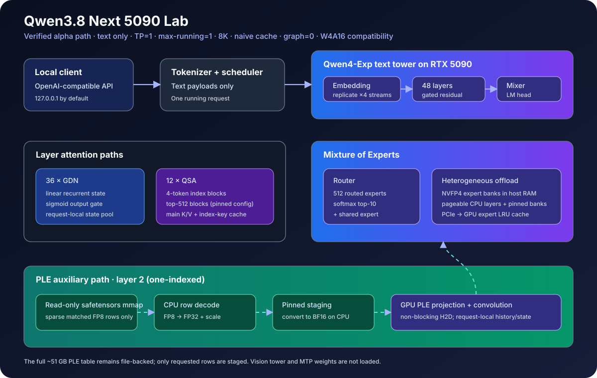

# Qwen3.8 Next 5090 Lab

[English](README.md) · [完整复现记录](docs/qwen4-exp.md) · [模型状态](docs/models.md) · [安全说明](SECURITY.md)

> [!IMPORTANT]
> 本项目是 [FreeToken](https://github.com/FlashML-org/FreeToken) 的**非官方、
> 实验性下游项目**，与 Qwen、RadixArk、NVIDIA、FlashML 及其贡献者均无隶属
> 或背书关系。

本项目让完整 135 GB
[`RadixArk/Qwen3.8-Flash-Next-NVFP4`](https://huggingface.co/RadixArk/Qwen3.8-Flash-Next-NVFP4)
checkpoint 在一张 32 GB RTX 5090 上接受文本或图片输入。它在 FreeToken 的
OpenAI 兼容 API 之上组合了稀疏 PLE 行流式读取、QSA Triton kernel、四路
gated residual、vision tower 和异构 MoE offload。

这是一个仅发布源码的开发者预览版。仓库不再分发模型权重，不占用
`freetoken` 官方包的发布名，也不声称“首个”“唯一”或“最快”。



架构图展示的是已经硬件验证的 v0.2 alpha 路径；历史 v0.1 不含 vision 分支，
并使用下文说明的 mmap/CPU PLE 解码。

## 已验证的 v0.1 边界

| 项目 | `v0.1.0-alpha.1` 承诺范围 |
|---|---|
| 输入 / 输出 | 仅文本输入和文本输出 |
| 硬件 | 单张 RTX 5090（32 GB）、TP=1、WSL2/Ubuntu 24.04 |
| 调度 | 同时运行一个请求，总 token 上限 8,192 |
| Cache / graph | naive cache；关闭 radix prefix reuse 和 CUDA graph |
| 专家计算 | 保留 NVFP4 packed routed weights，BF16 activation（**W4A16 compatibility**） |
| Checkpoint | 固定 revision `7b719225242aacd3dbd3f9407468c2ee9a9d2594` 的完整 135,253,622,894 字节目录 |
| 不在范围内 | 图片、视频、音频、MTP、多并发、32K/262K、原生 W4A4 parity |

checkpoint 声明 routed expert 使用 W4A4 方案。本 alpha 保留 packed NVFP4
权重，但没有消费 checkpoint 的 activation-scale 契约，所以当前结果只能称为
W4A16 compatibility，不能继承 W4A4 的质量结论，也不能声称与其数值等价。

## 已完成硬件验证的 v0.2 alpha：256K 与图片

`v0.2.0-alpha.1`（代码版本 `0.2.0a1`）已经在固定完整 checkpoint 上完成一次
经过审阅的整机验证，并已达到预发布条件。它只证明下面这组窄范围硬件契约，
不代表通用模型支持或原生 W4A4 parity。审阅记录位于
[`results/rtx5090-2026-08-28-v02-alpha1-757872a-run7`](results/rtx5090-2026-08-28-v02-alpha1-757872a-run7/)。

| 验证项目 | `v0.2.0-alpha.1` 已验证契约 |
|---|---|
| 上下文计数 | 总计 262,144 token，包括渲染后的文本、展开后的图片 token 与输出 |
| 边界证明 | 文本和含真实图片的请求各完成一次准确的 261,120 输入 + 1,024 输出 |
| 硬件 / 调度 | 单张 RTX 5090（32 GB）、WSL2、TP=1、同时一个请求、512-token prefill chunk |
| Cache / graph | naive cache；关闭 radix prefix reuse 和 CUDA graph |
| 图片 | OpenAI 结构化 `image_url`；HTTPS 或 base64 data URL；最多 4 张 |
| 仍不支持 | 视频、音频、MTP、radix cache、TP>1、多请求调度及超过 262,144 token |

已验证 profile 的入口为：

```bash
q38lab doctor --profile rtx5090-wsl2-256k-image
q38lab serve --profile rtx5090-wsl2-256k-image
q38lab smoke --images
```

审阅运行已经完成准确的文本/图片边界请求、Needle-in-a-Haystack、确定答案图片
用例、100/100 次文本/图片混合顺序请求和 30 分钟 soak，并满足 TTFT 不超过
15 分钟、稳态 decode 不低于 5 tok/s、峰值显存低于 31 GiB、WSL RSS 低于
105 GiB、WSL swap 为 0。引用性能时必须同时附带英文生成表和相邻原始记录。

## 执行路径

- **PLE 只读取命中的行。** 已验证 v0.1 使用只读 safetensors mmap，在 CPU
  解码命中行。v0.2 profile 则强制要求 Linux 原生 `io_uring` +
  `O_DIRECT`、全局有界的 4 GiB 原生 LRU、4 KiB 对齐读取、queue depth 512，
  每批最多 4,096 页；双缓冲 pinned FP8 行传到 GPU 后解码、缩放为 BF16。
  mmap 在该 profile 中仅为单测/debug fallback。
- **QSA 使用独立缓存。** v0.2 profile 为每 4 token 持久保存一个 index key，
  并保留请求级尾部 ring 和真实 mRoPE 坐标。完整 256K 的 12 层主 K/V 与压缩
  索引预算为 6.1875 GiB；SM120 selector 使用最大 128 MiB 的 FP32 workspace
  和 top-512 kernel，同时保留 Torch oracle 与原 Triton 路径作为正确性 fallback。
- **专家权重跨越多级内存。** 每层 512 个 routed experts 采用 top-10，结合
  pageable CPU layers、pinned host banks、PCIe 传输和 GPU expert cache；
  shared expert 仍在每层参与计算。v0.2 profile 还启用 route-aware 的
  native-NVFP4 prefill 搬运：当前层 router 完成后，用固定 512 项的 mask 找出
  命中的 raw expert ID。单个 expert 行不小于 256 KiB 的大 bank 只搬运按 ID
  合并后的命中连续段；更小的 bank 仍作为一个整层条目搬运，以保证 CUDA
  batched copy 保持异步。该路径保留 raw ID 和完整 `[E]` 双缓冲布局，不做
  expert-ID 压紧，也不会减少为 GPU buffer 预留的空间。已注册的 pinned bank
  在可用时直接 DMA；LOCKED/PAGEABLE 层经过两个固定的 32 MiB pinned bounce
  slab。
- **图片在四路 residual 复制前注入。** v0.2 profile 加载 27 层 vision tower，用固定
  Transformers `5.16.1` processor 展开 placeholder，构建三轴 interleaved
  mRoPE；合并后的视觉 embedding 在四路 gated-residual stream 复制前写入。
  每张图片只编码一次，完整 BF16 embedding 暂存在 pageable CPU；每个
  512-token prefill chunk 只传输与当前图片 span 相交的部分。
- **性能数字有原始证据。** environment、最终解析配置、请求时间、RSS、VRAM、
  page fault、PCIe 采样、测试结果和 checksum 一起保存；README 的数字由
  `summary.json` 生成。

## 从源码安装

已验证环境是 WSL2 内的 Linux x86-64。源码和模型必须放在 WSL 发行版自己的
ext4 文件系统中，不要放到 `/mnt/c` 或 `/mnt/d`。WSL 内安装 CUDA 13 toolkit，
不要安装 Linux 显卡驱动；GPU 由 Windows NVIDIA 驱动提供给 WSL。

```bash
git clone https://github.com/wimi321/qwen38-next-5090-lab.git
cd qwen38-next-5090-lab

uv sync --locked --extra accel
source .venv/bin/activate

q38lab doctor
```

为兼容现有 FreeToken 代码，源码包仍保留 `import freetoken` 和 `ft` 命令。
请使用独立虚拟环境；本包不能和上游 `freetoken` distribution 共装。

## 下载固定版本的 checkpoint

下载前请阅读[模型许可证说明](MODEL_LICENSES.md)。命令要求用户明确确认 Qwen
许可条款，固定指定 revision；如果该 revision 消失，命令会停止，不会静默换模型。

```bash
q38lab download --accept-qwen-license

# 可选：重新读取并 hash 整个本地 checkpoint。
q38lab download --accept-qwen-license --full-verify
```

已验证副本包含 419 个非缓存文件、206 个 safetensors 文件，共
135,253,622,894 字节。模型文件不会进入 Git 仓库或 GitHub Release。

固定版本下载器会在 Hugging Face 解析并下载准确 commit 后，在 checkpoint
目录外写入验证凭据。`serve` 每次都会重新核对全部控制文件 hash 和完整文件
stat fingerprint。可选的 `--full-verify` 还会重新读取全部 135 GB，发布证据
必须使用它；只有文件数量/大小正确而没有凭据的目录不会被 `serve` 接受。

## 启动服务

```bash
q38lab serve --profile rtx5090-wsl2
```

profile 固定在已审计的启动边界：`memory-ratio=0.89`，`num-tokens`、
`max-seq` 和 `max-prefill` 均为 8192，`max-running-requests=1`，naive cache，
`qsa_triton`，graph 关闭，MoE offload 和 expert cache 自动定容。配置优先级为：
CLI 参数 > `Q38LAB_*` 环境变量 > profile 默认值。

无鉴权服务默认只监听 `127.0.0.1`。如果没有显式危险确认参数，`q38lab` 会
拒绝把无鉴权服务绑定到非 loopback 地址。`--unsafe-allow-non-loopback` 只表示
风险确认，不会增加鉴权或 TLS；不要把此开发服务直接暴露到网络。

完成硬件验证的 v0.2 256K/图片 alpha 使用独立 profile；原生
`io_uring`/`O_DIRECT` 或内存预算不满足时会拒绝启动：

```bash
q38lab serve --profile rtx5090-wsl2-256k-image
```

该 profile 解析为 `max-seq-len=num-tokens=262144`、
`max-prefill-length=512`、`max-running-requests=1`、`qsa_triton_sm120`、
naive cache、graph 关闭、原生 PLE streaming、vision 加载，以及 route-aware
native-NVFP4 MoE prefill。稀疏 MoE 路径要求已有的双缓冲 prefill cache，并会
拒绝任何非 native NVFP4 的 bank 布局。它有意等待当前层的 routing 结果，不再
提前搬运下一层完整 expert bank，同时关闭独立的 prefill hit-D2D 路径；因此
净性能必须从已审阅 evidence 引用，不能从源码直接推断。预算器先为 QSA cache、
selector workspace、vision 权重与运行余量预留显存，再自动定容 GPU expert
cache；固定几何无法装进解析后的 0.89 预算时会直接失败。严格低于 31 GiB 的
验收峰值由已审阅 evidence 实测，不由这项预算算术单独证明。

使用维护者选定的公开 HTTPS fixture 检查 v0.2 图片接口；这条 smoke 命令
本身不构成发布证据：

```bash
HTTPS_IMAGE_URL='https://replace-with-your-public-fixture.example/chart.png'
q38lab smoke --images --https-image-url "$HTTPS_IMAGE_URL"
```

也可以用 OpenAI Python 客户端调用：

```python
from openai import OpenAI

client = OpenAI(base_url="http://127.0.0.1:1919/v1", api_key="local-only")
response = client.chat.completions.create(
    model="qwen3.8-flash-next-nvfp4",
    messages=[{"role": "user", "content": "只回复：q38lab-ok"}],
    temperature=0,
    max_tokens=32,
)
print(response.choices[0].message.content)
```

v0.2 alpha 通过同一 API 接受图片。下面的请求格式属于已验证输入契约，但支持
范围仍严格限定在记录的硬件与调度边界内：

```python
response = client.chat.completions.create(
    model="qwen3.8-flash-next-nvfp4",
    messages=[{
        "role": "user",
        "content": [
            {"type": "image_url", "image_url": {"url": "https://example.org/chart.png"}},
            {"type": "text", "text": "图表里的最高值是多少？"},
        ],
    }],
    temperature=0,
    max_tokens=128,
)
```

v0.2 实现只处理 HTTPS 和 base64 图片 data URL。
每个请求最多 4 张、单张不超过 20 MiB、
总计不超过 40 MiB，抓取总超时 10 秒。HTTP/本地文件、loopback、private、
link-local 或 reserved 地址、不安全重定向、DNS rebinding、不支持的 MIME、
音频和视频都会被拒绝。含图片的请求不会进入共享文本 prefix cache；请求释放时
同步清理媒体字节、视觉 embedding 和 mRoPE 状态。

`Q38LAB_DOH_FALLBACK=1` 只用于 WSL/TUN 的透明 fake-IP DNS 把所有公网域名都
解析为 non-global 地址的环境，默认关闭。显式开启后，fallback 连接固定的
Cloudflare DoH 公网 IP `1.1.1.1` 和 `1.0.0.1`，同时用
`cloudflare-dns.com` 做 TLS SNI 与证书校验；DoH 返回的目标地址仍必须全部是
global。公网/non-global 混合答案和数字 IP 字面量永远不会走 fallback。
`doctor --json` 与发布证据会记录是否开启该选项，
也会记录 libc `getaddrinfo` 只有受 deadline 和四个槽位约束的软取消：已经进入
libc 的查询没有可移植的硬取消机制。这个兼容路径不会扩大已验证的 v0.2 契约，
也不会降低任何证据门槛。

流式调用只需加入 `stream=True` 并迭代 chunks。`q38lab smoke` 还覆盖两种
thinking 模式和一次带 schema 的工具调用。模型输出不是安全边界；应用仍必须
校验工具名和参数。

## 复现实测证据

```bash
q38lab bench --profile rtx5090-wsl2 \
  --out results/rtx5090-YYYY-MM-DD
```

这是唯一的正式 release harness，不是快速 microbenchmark。它会重新 hash 完整
checkpoint，运行非 slow 测试，验证 prompt/API 门槛与 100 个顺序请求，然后另行
运行至少 30 分钟的周期生成 soak，并连续采样资源。它读取 `q38lab serve` 写入的
启动证明；源码树不干净、运行 commit 不匹配或服务进程不一致都会直接失败。

不能脱离相邻的 environment 和 resolved-config 记录单独比较数字。TTFT 从客户端
观测；“effective prefill”包含固定请求开销与 CPU staging，不是纯 kernel benchmark。

v0.2 harness 按 profile 记录 selector workspace 上限、PLE 读取量/cache/wait/
page-fault、图片 token、vision latency、各 prefill chunk timing，以及
route-aware MoE prefill 计数。`q38lab.moe_prefill` snapshot 会给出各层调用中
命中的唯一 expert 行总数、对应的 512 行机会数、实际计划复制的字节，以及假设
所有 bank 都整层复制时的字节数。由于小于 256 KiB 的 bank 仍整层搬运，byte
fraction 与 row fraction 本来就可能不同；这些是搬运记账计数，不是虚构的硬件
PCIe 实测值。启动证明还会携带真实 PLE checkpoint 探针：128 个 shard 的全部
边界行以及 8 个确定性 bigram/trigram hash 行，必须在 GPU FP8 解码后与独立
safetensors slice 精确一致。
只有同时包含两次 261,120 + 1,024 边界证明，并通过资源、吞吐、混合顺序请求和
soak 门槛的证据目录才可发布。上面的 run7 目录已经满足这些要求，英文 README
的 generated benchmark 区块现由该 v0.2 记录生成。

v0.2 profile 必须使用维护者持有的确定性本地图片和稳定的公开 HTTPS fixture：

```bash
q38lab bench --profile rtx5090-wsl2-256k-image \
  --image-file "$HOME/q38lab-fixtures/chart.png" \
  --https-image-url "https://example.org/q38lab-chart.png" \
  --decode-tokens 1024 \
  --timeout 1200 \
  --out results/rtx5090-256k-image-YYYY-MM-DD
```

两个图片参数都是必填项；30 分钟 soak 会持续交替文本/图片请求，避免图片专属
泄漏在后续纯文本平台期中被掩盖；`--decode-tokens` 可取 256–1,024。harness 会核对
干净 commit 的启动证明、独立计算所有边界 token，并在门槛或 telemetry
cross-check 缺失时拒绝生成可发布证据。若透明 fake-IP 环境必须开启 DoH
fallback，应给 `doctor`、`serve` 和 `bench` 使用相同的
`Q38LAB_DOH_FALLBACK=1`；证据会保留该 opt-in 值与系统 resolver 的软取消局限。

硬件数字只由已审阅 evidence 的 `summary.json` 生成。权威表格由英文
[README](README.md) 的 generated benchmark 区块维护；中文文档不手工复制
性能数字，以免证据更新后出现不一致。

英文表中的 **Peak VRAM** 和 **Peak WSL RSS** 是正式 API 验收窗口内的最大值，
该窗口从第一个 API 请求开始，到最后一次 soak 结束；它们不是整个 harness 的
峰值。原始
[`resource-samples.csv`](results/rtx5090-2026-08-28-v02-alpha1-757872a-run7/resource-samples.csv)
还包含验收窗口之前的 preflight 和 pytest 采样，其中包括一次更高的瞬时显存值。
引用资源行为时必须同时说明这一区别并检查原始采样。

验证时 WSL 的 `swap=0`。Windows 宿主已有 pagefile，因此本项目**不声称宿主没有
发生分页**。早期 7-token completion 也不会被当作稳态 decode benchmark；
v0.1 gate 使用独立的 256–512 token 测量，v0.2 契约允许 256–1,024 token。

引用数字前请阅读[完整步骤与限制](docs/qwen4-exp.md)。

## 项目状态

已验证的 v0.1 alpha 继续作为窄范围 8K 纯文本 profile。v0.2 alpha 只在记录的
RTX 5090/WSL2 边界内达到预发布条件：TP=1、同时一个请求、naive cache、graph
关闭、W4A16 compatibility、总计 262,144 token 和图片输入。更后续的里程碑包括：

1. 完整 reference parity 与原生 SM120 W4A4 activation path。
2. PLE hot-row 优化，以及经过验证的 QSA/PLE CUDA graph capture/replay。
3. 视频/音频评估、MTP、radix-cache 语义和超过单请求 262,144 token 的上下文。

v0.1 profile 仍拒绝媒体。v0.2 验证不会扩展到记录边界之外：视频、音频、MTP、
radix cache、TP>1、多请求调度、原生 W4A4 parity 和超过 262,144 token 的上下文
仍不支持。

## 来源、贡献与引用

本项目保留 FreeToken 的完整历史，审计基线为上游 commit
`9ef3651309fe4058672f2cc92069238dea06be1b`。下游变更见
[MODIFICATIONS.md](MODIFICATIONS.md)，保留的第三方归属见
[THIRD_PARTY_NOTICES.md](THIRD_PARTY_NOTICES.md)。
v0.2 SM120 top-512 specialization 是对
[`yhfgyyf/sglang-qwen38-flash-next-sm120`](https://github.com/yhfgyyf/sglang-qwen38-flash-next-sm120)
准确 commit `30edf3503961a471b25150aa890f8166031b5738` 的 Apache-2.0 改编。
设计审阅还参考了 SGLang 的
[Qwen3.8 集成 PR #36497](https://github.com/sgl-project/sglang/pull/36497)、
[PLE NVMe PR #36567](https://github.com/sgl-project/sglang/pull/36567) 和
[SM120 QSA PR #36556](https://github.com/sgl-project/sglang/pull/36556)。
这些项目和结果不为本下游背书；其 96 GB、MTP、CUDA Graph 参数与性能数字
也不是本项目结果。

每项贡献都必须由人类维护者理解并实测。项目不接受模型权重、隐私日志、编造的
benchmark 或无人复核的纯 agent 提交。提交 issue 或 PR 前请阅读
[CONTRIBUTING.md](CONTRIBUTING.md)。学术使用请同时引用本项目
[CITATION.cff](CITATION.cff) 和提供底层 serving engine 的 FreeToken 工作。

## 许可证

- 仓库代码和文档：[Apache License 2.0](LICENSE)，并保留 FreeToken 和第三方归属。
- Qwen 模型文件：独立的
  [Qwen Community License 1.0](https://huggingface.co/Qwen/Qwen3.8-Flash-Next/blob/main/LICENSE)。
- RadixArk checkpoint：模型卡要求参照源模型条款，并称其为 candidate release。

仓库的 Apache-2.0 不授予模型权利或商标权。本说明不是法律意见；使用者必须自行
确认其使用和部署所适用的全部条款。
